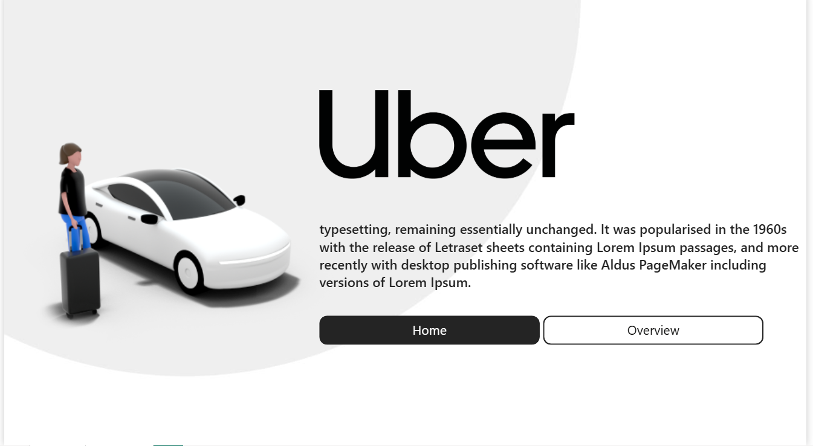
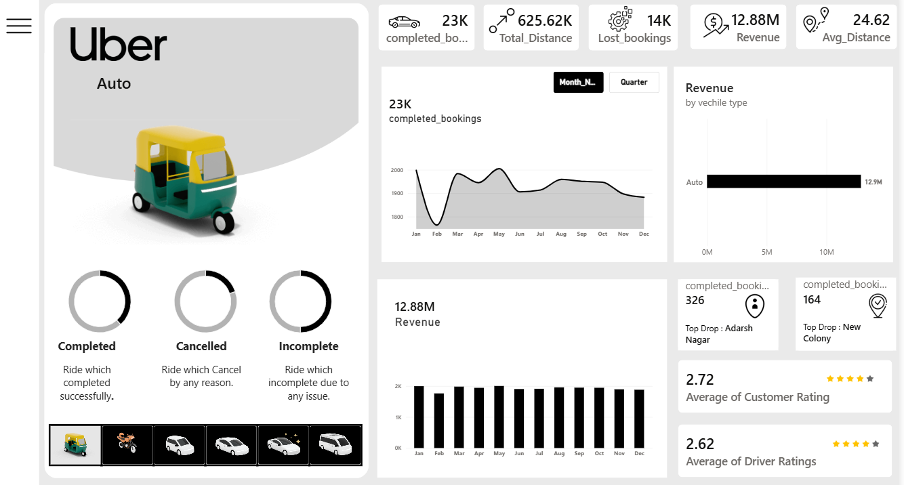

# 🚕 Uber Auto Booking Analysis Dashboard

## 📌 Project Overview

This project presents an interactive **Uber Auto Booking Analysis Dashboard** designed to analyze booking performance, revenue, trip distance, booking status, vehicle types, and customer/driver ratings.

The dashboard transforms raw booking data into meaningful visual insights that can help understand overall ride performance and identify important trends.

---

## 🎯 Project Objectives

- Analyze overall booking performance.
- Track completed, cancelled, and incomplete bookings.
- Monitor revenue and total trip distance.
- Analyze booking trends over time.
- Compare revenue across vehicle types.
- Identify top pickup and drop-off locations.
- Analyze customer and driver ratings.
- Present key KPIs through an interactive dashboard.

---

## 📊 Key KPIs

- **23K** Completed Bookings
- **625.62K** Total Distance
- **14K** Lost Bookings
- **$12.88M** Revenue
- **24.62** Average Distance
- **2.72** Average Customer Rating
- **2.62** Average Driver Rating

---

## 📈 Dashboard Features

### Booking Analysis
- Monthly booking trends
- Completed, cancelled, and incomplete bookings
- Booking performance overview

### Revenue Analysis
- Total revenue
- Monthly revenue trends
- Revenue by vehicle type

### Location Analysis
- Top pickup locations
- Top drop-off locations

### Rating Analysis
- Average customer rating
- Average driver rating

### Interactive Dashboard
The dashboard includes interactive navigation and filtering to make exploring the data easier.

---

## 🔍 Key Insights

- The dashboard recorded around **23K completed bookings**.
- Total revenue reached approximately **12.88M**.
- The total recorded distance exceeded **625K**.
- Auto is the analyzed vehicle type and generated the majority of the displayed revenue.
- **Adarsh Nagar** was the top pickup location with **326 bookings**.
- **New Colony** was the top drop-off location with **164 bookings**.
- The average customer rating was **2.72**, while the average driver rating was **2.62**.

---

## 🛠️ Tools & Skills

- Power BI
- Data Cleaning
- Data Transformation
- Data Visualization
- Dashboard Design
- KPI Analysis
- Business Analysis

---

## 🖥️ Dashboard Preview

### Home Page

### Dashboard Overview

---

## 💡 Project Outcome

This project demonstrates how raw ride-booking data can be transformed into an interactive business dashboard that provides a clear view of booking performance, revenue, trip activity, locations, and customer/driver ratings.

---

## 👩‍💻 Author

**Mariam Khaled**

Aspiring Data Analyst | Power BI | Excel | SQL | Python
